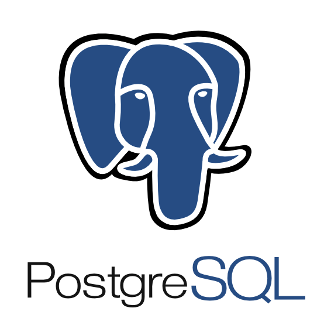

<div align="center">



# SQL Basics Workshop @ IPT

</div>


---

## Overview

Welcome to the **SQL Basics Workshop** at IPT!  
SQL (Structured Query Language) is the standard language for working with relational databases — the backbone of modern apps, from social networks to inventory systems.

In this hands-on workshop, you'll learn how to query, filter, and manipulate data using SQL. Whether you're a developer, analyst, or administrator, these skills are essential for working with data effectively.

---

## Getting Started

   > Devbox relies on Nix and will install it on your system. If you prefer not to install Nix globally, skip this install docker-cli and docker-compose individually.

1. **Install Devbox:** Follow the official [installation instructions](https://www.jetpack.io/devbox/docs/install)

2. **Install Docker (required)**
   Devbox installs the CLI tools (`docker`, `docker-compose`), **but not the Docker Engine itself**.
   You still need to install Docker manually:

   - **macOS / Windows**: [Install Docker Desktop](https://www.docker.com/products/docker-desktop)
   - **Linux (Ubuntu/Debian)**: [Install Docker Engine](https://docs.docker.com/engine/install/ubuntu/)

3. **Start the Devbox shell** in the project directory:

   ```bash
   devbox shell
   ```

4. **Start the environment**:

   ```bash
   docker-compose up -d
   ```

---
### 🌐 Accessing the Database

Once the containers are running (pgAdmin needs a few minutes to be ready), open your browser and go to [http://localhost:80](http://localhost:80)

Use the following credentials for **pgAdmin**:

- **Email**: `admin@sqlbasics.ch`
- **Password**: `relational`

When opening pgAdmin, expand the servers and click on the **workshop** server.
You’ll be prompted for a password — use the same one: `relational`.

Now you're ready for action!

---

## Workshop Structure
---

All exercises are in the `exercises/` folder, organized into three sections:

1. **Basics** – Create tables, insert data, and write basic queries.
2. **Performance** – Optimize queries and explore indexing.
3. **Permission Management** – Control access with users and roles.

Each section includes:

- A `README.md` with instructions
- The `README.md` file also includes solutions. If possible only reveal them if you are stuck or want to compare to your own solution.

---

## Clean Up

To shut down the running containers, run:

```bash
docker-compose down
```

This will stop and remove the containers (but not the data volume).

---

## Need Help?

This is a collaborative, beginner-friendly workshop.
Ask questions any time — no question is too small!

---

Let’s dive into SQL!
