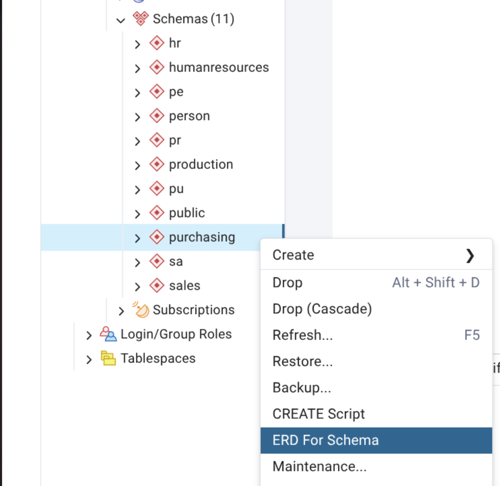
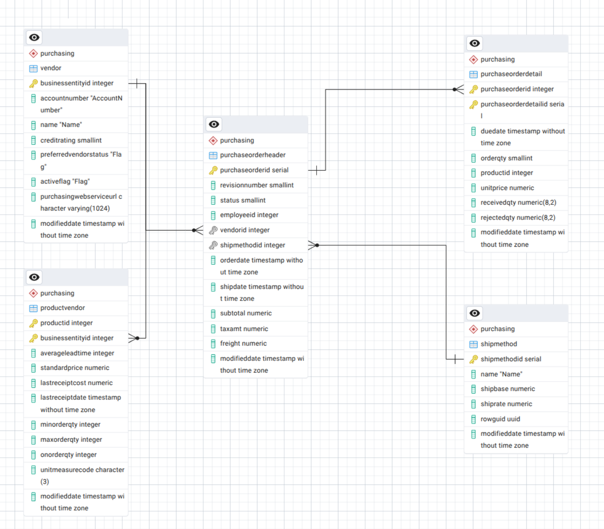

# Exercise 1: Fundamentals

## Topics

* [Analysing Data](#analysing-data)
    * Data Exploration
	* Filtering
    * Aggregates
    * Joins
* [Creating and maintaining Tables](#creating-and-maintaining-tables)
    * Table Creation
    * Relationships
    * Data Management 

## Analysing Data

We will be solving some typical data analysis riddles with increasing difficulty. The data is based on the AdventureWorks sample database - modelling a fictive bike shop. Notice that the sample data tries to simulate a realistic enterprise database; therefore it is slightly more complex than needed. In particular, its tables are partitioned into the following schemas:
- humanresources
- person
- production
- purchasing
- sales

In queries, schemas are simply prefixes. This means that for all purposes, they are prepended to the table using a dot as illustrated below to use the *product* table.

```sql
SELECT *
FROM production.product
```

### Exploring Data with pgadmin

Apart from having a good grasp of your available tools, however, the most challenging part in such endeavours is often a lack of understanding of the data itself.
Thus, it is recommended to first take a quick look around our practice database. This can be done by simply scanning the available tables. However, a more convenient approach is using so called **Entity Relationship Diagrams **(ERD) - a graphical depiction of tables and how they are connected with each other.



Pgadmin provides an easy way of generating such diagrams either on database or on schema level. Give it a try to obtain a better understanding of our bike shop data.



### SQL Query Syntax

Recall the basic syntax, you will need it to solve all of the puzzles below.

```sql
SELECT 		<cols>
FROM 		<table_a>
JOIN 		<table_b>
WHERE		<predicate>
GROUP BY	<cols>
HAVING		<agg_predicate>
ORDER BY	<cols>
```

- **SELECT:** Choose the columns of interest
- **FROM:** Origin of the data
- **JOIN:** Expand data source with additional tables using relationships
- **WHERE:** Filter data using boolean predicates
- **GROUP BY:** Aggregate data
- **HAVING:** Filter aggregated data
- **ORDER BY:** Sort data

### Join Types

When combining tables there are different modes. Dependening on the role of each table in a relationship you might want to treat them differently.

- **Inner Join** links rows from both tables only where a match exists in the respective column.
- **Left Join** returns all rows from the left table—if possible, with the matching rows from the right table.
- **Right Join** is symmetric to the Left Join.
- **Full Join** combines Left & Right Join.

### Riddles

1. How many active vendors are there?
	<details>
	<summary>Solution</summary>

	There are precisely **100** active vendors.

	```sql
	SELECT COUNT(*)
	FROM purchasing.vendor v
	WHERE v.activeflag is true;
	```
	</details>
	<p></p>


2. To which product category belongs the product 'Cable Lock'?

	<details>
	<summary>Solution</summary>

	The cable lock is in **Accessories**

	```sql
	SELECT pc.name
	FROM production.product p
	JOIN production.productsubcategory psc
		ON psc.productsubcategoryid = p.productsubcategoryid
	JOIN production.productcategory pc
		ON pc.productcategoryid = psc.productcategoryid
	WHERE p.name = 'Cable Lock';
	```

	</details>
	<p></p>

3. How many products have so far never been sold?

	<details>
	<summary>Solution</summary>

	**238** products have so far never been sold.

	```sql
	SELECT COUNT(DISTINCT p.productid)
	FROM production.product p
	LEFT JOIN sales.salesorderdetail sd
		ON p.productid = sd.productid
	WHERE sd.salesorderid is null;
	```

	</details>
	<p></p>

4. 	Which country has the longest waiting time on average between ordering something and having it shipped?

	<details>
	<summary>Solution</summary>

	Customers need to wait the longest on average in **Germany**.

	```sql
	SELECT AVG(sh.shipdate - sh.orderdate) as avg_waittime, sp.countryregioncode
	FROM sales.salesorderheader sh
	JOIN person.address a
		on sh.shiptoaddressid = a.addressid
	JOIN person.stateprovince sp
		ON sp.stateprovinceid = a.stateprovinceid
	GROUP BY sp.countryregioncode
	ORDER BY 1 DESC;
	```

	</details>
	<p></p>


5. 	In how many cities are at least four different persons living at exactly the same address?

	<details>
	<summary>Solution</summary>

	There's only one - **Paris**

	```sql
	SELECT distinct city
	FROM person.address a
	JOIN person.businessentityaddress ba
		ON ba.addressid = a.addressid
	JOIN person.person p
		ON p.businessentityid = ba.businessentityid
	GROUP BY a.addressline1, a.addressline2, a.city
	HAVING COUNT(DISTINCT (p.firstname, p.lastname)) > 3;
	```

	</details>
	<p></p>


6. 	Which pair of articles gets ordered together the most?

	<details>
	<summary>Solution</summary>

	**Water Bottle - 30oz & Mountain Bottle Cage** were ordered together 1692 times

	```sql
	SELECT p1."name", p2."name", COUNT(DISTINCT sd1.salesorderid)
	FROM sales.salesorderdetail sd1
	JOIN sales.salesorderdetail sd2
		ON sd1.salesorderid = sd2.salesorderid
	JOIN production.product p1
	ON sd1.productid = p1.productid
	JOIN production.product p2
	ON sd2.productid = p2.productid
	WHERE p1.productid != p2.productid
		-- not strictyl neccessary but avoids duplicate pairs
		AND p1.productid < p2.productid
	GROUP BY p1."name", p2."name"
	ORDER BY 3 DESC;
	```

	</details>
	<p></p>


## Creating and maintaining data structures.

In this section we want to have a look at Data Definition and Data Manipulation Language. In other words, we explore the means necessary to create, update and remove tables while also filling them with data.

### Toolset

Below is a short reminder of the necessary commands.


New tables are established using the CREATE TABLE command.
```sql
CREATE TABLE
<tablename> (
<columnname_1> <columntype_1>,
<columnname_2> <columntype_2>,
...
)
```

Tables can be modified using the ALTER TABLE command, thereby adding or removing columns.
```sql
ALTER TABLE <tablename>
ADD <columnname> <columntype>
```

To add data to empty tables you can use the INSERT INTO command as follows. Alternatively, you can also use queries instead of explicitly stating all the data in the VALUES clause.
```sql
INSERT INTO <tablename> (<columnname_1> , <columnname_2> , ...)
VALUES
(<columnvalue_1> , <columnvalue_2>, ...),
(<columnvalue_1> , <columnvalue_2>, ...),
...
```
Finally, data can be modified using the UPDATE command.
```sql
UPDATE <tablename>
SET <columnname> = <new_value>
WHERE <predicate>
```

### Adding returns

Our bike shop has unfortunately never thought of people returning their products. As a result, the clerks really didn't know what to do with their systems when the first unhappy customers arrived with faulty products and wanted their money back.

You were tasked to fix the situation. Start immediately and create a *returns* table. Think of sensible columns for such a table but don't overthink it. At the very least, we want to have some kind of id associated with each return.

<details>
<summary>Solution</summary>

```sql
CREATE TABLE
sales.returns (
returnid int,
return_reason varchar,
return_date date
)
```
</details>
<p></p>

Now try and insert some data into your newly created *returns* table. Depending on the structure you created before, either explicitly describing data yourself or using a SELECT statement might be more appropriate.

<details>
<summary>Solution</summary>

```sql
INSERT INTO sales.returns (returnid, return_reason, return_date)
VALUES
(1, 'didnt work', '2025-10-31'),
(2, 'too exhausting', '2025-6-12'),
(3, 'horrible color', '2025-8-31')
```
</details>
<p></p>

Your colleague just realized in horror, that it's possible to insert a return into your table without any valid returnid! Please add a primary key constraint as quickly as possible. You might need to look for some help as this use case takes a bit more than the basic table modification command.

<details>
<summary>Solution</summary>

```sql
ALTER TABLE sales.returns
ADD PRIMARY KEY(returnid)
```

</details>
<p></p>

The purchasing department heard of your new improvement. They would like to link returns with faulty products to check for faults. Help them by introducing a foreign key relationship.

<details>
<summary>Hint</summary>
Depending on your approach so far, this exercise consists of at most three steps:
- Add a *productid* column.
- Fill it valid ids from products in your database.
- Use the ALTER TABLE command to add a FOREIGN KEY constraint.
</details>


<details>
<summary>Solution</summary>

```sql
ALTER TABLE sales.returns
ADD COLUMN productid int
```

```sql
UPDATE sales.returns
SET productid = (
	SELECT productid
	FROM production.product
	LIMIT 1)
```

```sql
ALTER TABLE sales.returns
ADD FOREIGN KEY (productid) REFERENCES production.product (productid)
```

</details>
<p></p>
